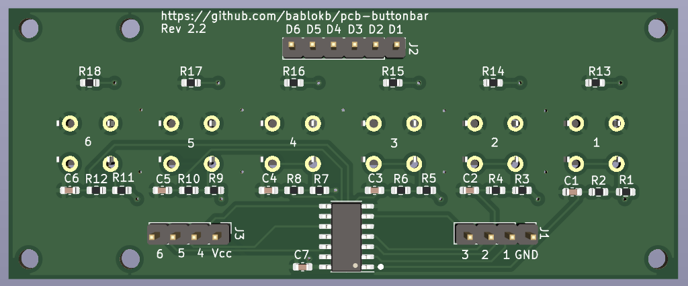

Project pcb-buttonbar
=====================

Overview
--------

This project contains the KiCAD files for a button-bar with
six buttons. Each button uses some additional hardware-components to
debounce the button:

The buttons are pulled up using R1. R2 and C1 serve as a lowpass-filter,
i.e. high frequency bouncing is filtered out. The final inverter, a
74HC14 is a Schmitt-Trigger type inverter. This inverter switches from
high to low at a different level than from low to high (hysteresis),
so this will convert the curve from the RC-filter to sharp edge.

Goodies
-------

The buttonbar supports 6x6mm buttons and 12x12mm buttons. In addition
to the debounce-logic (bottom side of the pcb), there are optional
LEDs+resistors on the top.

The footprints for the top-side are 1206, suitable for hand-soldering.
The bottom-side uses 0603, ideal for automatic assembly.

Production Files
----------------

In the directory `jclpcb` you will find gerber-files, bom and cpl-file
suitable for JCLPCB. Migrating to a format suitable for your favorite
pcb-assembly service should be straightforward.

Test Program
------------

The directory `src` contains a simple test program. Without the debouncing
in hardware, you would have to pass an additional parameter to the
Button-constructor for debouncing in software.
